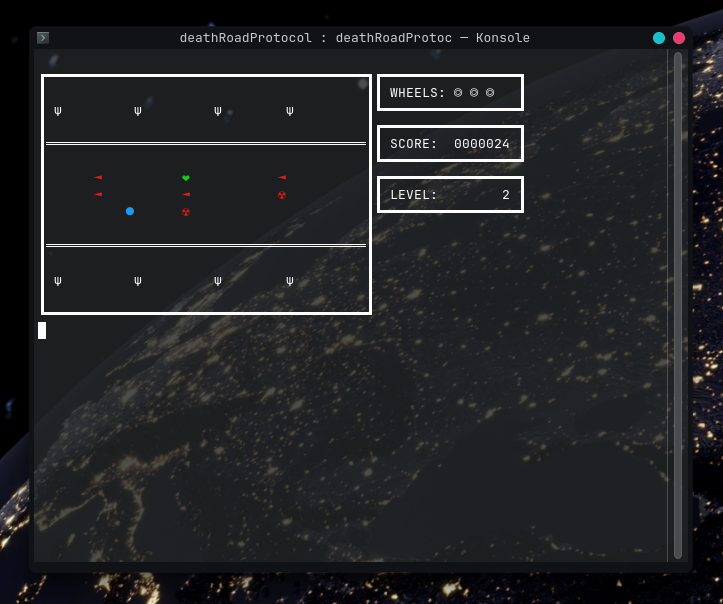
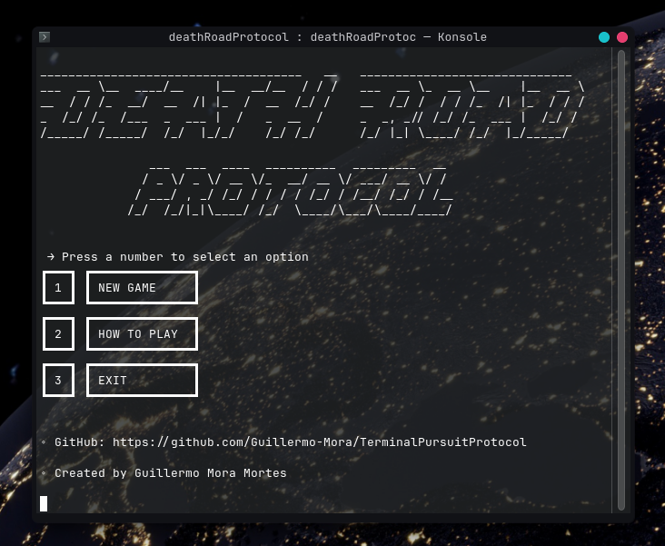

# Death Road Protocol

A terminal-based arcade game developed entirely in Bash.

## About The Game

**Death Road Protocol** is a terminal-based arcade game where you take control of a car racing down an endless road. Dodge or eliminate enemies, collect power-ups, and try to survive as the speed steadily increases.

The game features a horizontally scrolling view rendered directly in the terminal, delivering a fast-paced arcade experience using nothing but Bash.

## Gameplay Preview



## Requirements

* A Bash-compatible terminal.

The game is intended for Linux and macOS. On Windows, you may be able to run it through WSL or another compatible Bash environment.

## How To Play It

1. Download `deathRoadProtocol.sh` from this repository.

2. Open a Bash terminal in the directory containing the file.

3. Grant execution permission:

   ```bash
   chmod +x deathRoadProtocol.sh
   ```

4. Start the game:

   ```bash
   ./deathRoadProtocol.sh
   ```

Alternatively, you can run the script directly with Bash:

```bash
bash deathRoadProtocol.sh
```

## Built With

